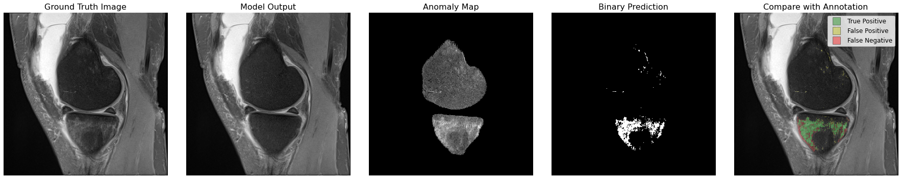
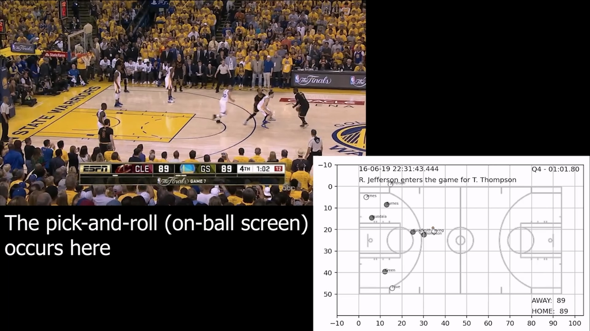

# About Me
I am a PhD CS student at Case Western Reserve University and research assistant at Cleveland Clinic. I am studying Generative AI, Computer Vision, and Quantitative Medical Imaging. I also enjoy road cycling and playing guitar and piano.

andrewyuysh (at) gmail

[CV](./assets/cv_2023.pdf)

# Research
I am working with **Dr. Xiaojuan Li @ Cleveland Clinic** to use advanced MR imaging to promote musculoskeletal health. We are using generative models to predict osteoarthritis progression.

I am also studying the evaluation and fine-tuning of foundational generative models for small-domain tasks with **Dr. Vipin Chaudhary @ Case Western Reserve University**.

With **Dr. Sun Sunnie Chung @ Cleveland State University** I used real-time NBA basketball player movement data to predict plays. We also ran sentiment analysis of reddit comments during NBA games.

# Fun
In progress...
