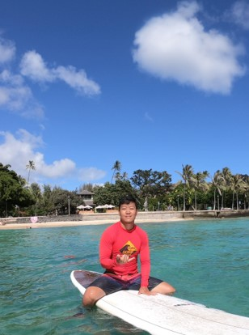

# About Me
Hey there. I'm a PhD CS student at Case Western Reserve University and research assistant at Cleveland Clinic. I am studying Generative AI, Computer Vision, and Medical Imaging. I also enjoy road cycling and playing guitar and piano.

andrewyuysh (at) gmail

# Projects
I am working with Dr. Xiaojuan Li to use advanced MR imaging to promote musculoskeletal health. We are using generative models to predict osteoarthritis progression.
Papers will be added here...

# Fun
In progress...
